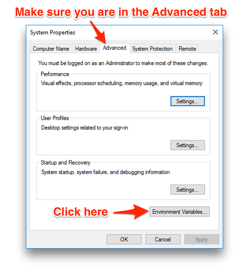
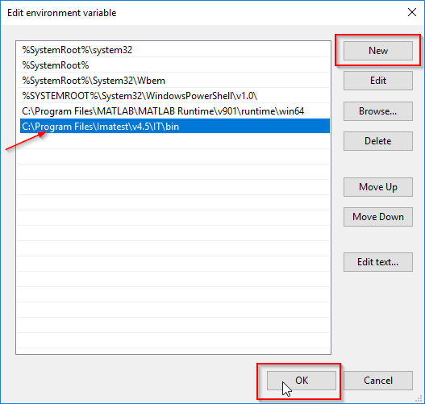

# Rotating cube using sdl2

## WARNING FOR LINUX AND MAC USERS
if you`re using linux or mac, line 4 from display.hpp and line 5 from 
main.cpp must be changed.
Change the include<SDL.h> to include<SDL2/SDL.h>
If you're using windows, just ignore this.

## how to compile and run the file

In order to run the program in your computer you need to
compile it first.

## How to compile in Windows
For compiling the code in your windows machine you'll have to first install Mingw and SDL2 in your machine.
You can donwload Mingw [here](https://ufpr.dl.sourceforge.net/project/mingw/Installer/mingw-get-setup.exe)
In the installation process, select the mingw32-gcc-g++ and the mingw32-base check boxes. Then click in the installation tab and apply the changes.

After downloading MINGW, you'll have to add the bin directory to the enviroment variables. To do so, On the Windows taskbar, right-click the Windows icon and select System. In the Settings window, under Related Settings, click Advanced system settings. On the Advanced tab, click Environment Variables

In the Enviroment variables menu, click on path - Edit and Add C:\MinGW\bin to the list. 

Now, you can open the cmd and run 'g++ --version' to see if it works. If the g++ compiler version is displayed, it means that the compiler is now working.

Now you have to install SDL2 in your machine. You can download it 
[here](https://www.libsdl.org/release/SDL2-devel-2.0.20-mingw.tar.gz)

After downloading it, extract the i686-w64 file to your C: directory and change the name to mingw_dev_lib

Done!! Now you are ready to compile and run the program in your machine
 ### Compiling the file
 open the cmd and go to the program directory. Now run the command -'mingw32-make'

 if you receive no error messages it means the compilation was a success.

 ### Running the program
 After compiling, to run the program, run the 'mingw32-make run' command.

 You should now be seeing a cube rotating in your screen. To close the window, press the 'esc' key.

 ## How to compile in linux

 in order to compile the file you need to install the g++ compiler, to do so, open the terminal and run the command ' sudo apt-get install build-essential'.
 After that, run the command 'g++ --version'. If the version of g++
 is displayed on screen, it means the compiler was installed successfuly.

 You also have to install SDL2 in your machine in order to compile the
 code. To do so, run the command 'apt-get install libsdl2-dev' in your terminal. 

 ### compiling the file
 Done!! everything is ready now. All you have to do now is open the terminal in the program directory and run the 'make build-linux' to compile the file.

 ### running the file in linux
to run the file, all you have to do is run the command 'make run'.
you should be able to see a rotating cube in your screen. 
press the 'esc' key to close the window.

## How to compile in MAC

in order to compile the file you need to install SDL2 in your machine. To do so, open the terminal and run the command 'brew install sdl2'
Done. now you should be able to compile the file

 ### compiling the file
 Done!! everything is ready now. All you have to do now is open the terminal in the program directory and run the 'make build-linux' to compile the file.

 ### running the file in MAC
to run the file, all you have to do is run the command 'make run'.
you should be able to see a rotating cube in your screen. 
press the 'esc' key to close the window.
 